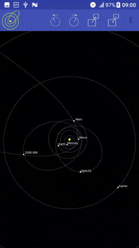

# SolarSystem
An Android app that animates the motion of the planets and select minor planets, asteroids, and comets in the solar system using Java threads for the animation.

The projects in these repositories correspond to individual lessons in the free online android programming course at http://eagle.phys.utk.edu/guidry/android/ 

## Prerequisites
This project assumes the Gradle build system in Android Studio. It was targeted at Android 6.0 (API 23) but should be compatible with API 15 and beyond.  You will need

 - Android Studio (<a href="https://developer.android.com/studio/install.html" target="_new">Installing Android Studio</a>)
 - Some image files that may be found in this  <a href="http://eagle.phys.utk.edu/guidry/android/images" target="_new">images directory</a>
 - An Android phone or tablet, or an Android phone or tablet emulator launched from Android Studio

## Getting Started
First download this project using the <b>Clone or Download</b> button, either by importing into Android Studio using GitHub version control, or by downloading and unpacking a <i>.zip file.</i>  Full instructions for both may be found by going to 
http://eagle.phys.utk.edu/guidry/android/ and selecting <i>Resources > Packages for All Projects</i> from the menu.

A complete description of this project, including steps to build it from scratch, may be found by going to 
http://eagle.phys.utk.edu/guidry/android/ and selecting <em>Solar System I</em> from the menu.
